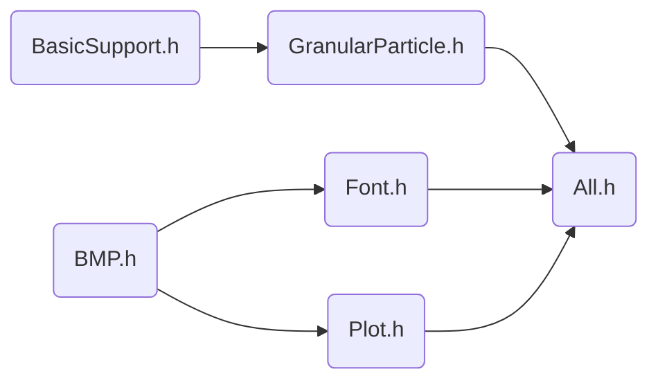

[TOC]

### 程序包说明

#### 头文件依赖顺序

#### 类、函数、变量说明

##### ``Pi(BasicSupport.h)`` pi值

$\pi$  。 ``double Pi = 3.14159265358979323846264f`` 。

##### ``sqr(BasicSupport.h)``  平方函数

平方。 ``double sqr(double);`` 。

##### ``DVector(BasicSupport.h)``  向量

|                             定义                             |                             说明                             |
| :----------------------------------------------------------: | :----------------------------------------------------------: |
|              ``std::vector<double> Elements;``               |                  **成员变量**，维护向量内容                  |
|                        ``bool Type;``                        | **成员变量**，表示向量类型。``False``为列向量，``True``为行向量 |
|                       ``DVector()l;``                        |         缺省**构造函数**，默认向量大小为$0$，列向量          |
|                  ``DVector(const int &);``                   |           **构造函数**，参数为向量维数，（列向量）           |
|           ``DVector(const int &, const bool &);``            |            **构造函数**，参数为向量维数、向量类型            |
|          ``DVector(const int &, const double &);``           |    **构造函数**，参数为向量维数、初始填充数值，（列向量）    |
|   ``DVector(const int &, const bool &, const double &);``    |     **构造函数**，参数为向量维数、向量类型、初始填充数值     |
|                       ``~DVector();``                        |                         **析构函数**                         |
|                    ``int Size() const;``                     |                  **成员函数**，返回向量维数                  |
|                   ``double Mod() const;``                    |                **成员函数**，返回向量中元素和                |
|                    ``void Resize(int);``                     |                  **成员函数**，重设向量维数                  |
|                     ``void SetZero();``                      |   **成员函数**，将向量设为$\overrightarrow 0$ ，不改变维数   |
|                        ``void T();``                         |                 **成员函数**，将当前向量转置                 |
|                    ``DVector T() const;``                    |       **成员函数**，返回当前向量的转置，不改变当前向量       |
|          ``DVector& operator = (const DVector &);``          |                      **运算符**，深拷贝                      |
| ``friend DVector operator + (const DVector &a, const DVector &b); `` |                     **友元运算符**，加法                     |
|               ``DVector operator -() const;``                |                **运算符**，单元运算符，相反数                |
| ``friend DVector operator - (const DVector &a, const DVector &b);`` |                     **友元运算符**，减法                     |
| ``friend DVector operator * (const double &a, const DVector &b);`` |                    **友元运算符**，左数乘                    |
| ``friend double operator * (const DVector &a, const DVector &b);`` |                     **友元运算符**，内积                     |
|                   ``double NormSquare();``                   |           **成员函数**，返回 $|\mathbf \alpha|^2$            |
|                      ``double Norm();``                      |            **成员函数**，返回 $|\mathbf \alpha|$             |
|                       ``DVector e();``                       |               **成员函数**，返回该方向单位向量               |

##### ``singleParticle(GranularParticle.h)`` 单粒子

|            定义             |             说明             |
| :-------------------------: | :--------------------------: |
|      ``double Mass;``       |      **成员变量**，质量      |
|    ``DVector Position;``    |      **成员变量**，位置      |
|    ``DVector Velocity;``    |      **成员变量**，速度      |
|  ``singleParticle(int);``   | **构造函数**，参数为空间维数 |
|    ``singleParticle();``    |  缺省**构造函数**，默认二维  |
| ``void SetDimention(int);`` |  **成员函数**，设置空间维数  |
|   ``void OutputState();``   |  **成员函数**，输出粒子状态  |

##### ``particleGroup(GranularParticle.h)`` 粒子组

|                             定义                             |                             说明                             |
| :----------------------------------------------------------: | :----------------------------------------------------------: |
|          ``std::vector<singleParticle> Particles;``          |                  **成员变量**，维护粒子状态                  |
|                       ``int Number;``                        |                   **成员变量**，维护粒子数                   |
|                      ``int Dimention;``                      |                  **成员变量**，维护空间维数                  |
|                 ``particleGroup(int, int);``                 |           **构造函数**，参数依次为空间维数、粒子数           |
|                     ``particleGroup();``                     |          缺省**构造函数**，默认二维空间，100个粒子           |
|                       ``void Init();``                       | **成员函数**，设置所有粒子质量为 $1$ ，速度、位置为 $\mathbf 0$ |
|                    ``double KEnergy();``                     |                   **成员函数**，返回总动能                   |
|                  ``double KTemperature();``                  |            **成员函数**，返回温度，定义为平均动能            |
| ``double Energy(double (*Potential)(const singleParticle &, const singleParticle &));`` | **成员函数**，返回体系总机械能，需要传入函数指针``Potential``，定义粒子间两两势能 |
|          ``void PositionRand(double L, double R);``          |   **成员函数**，将所有粒子在空间坐标 $[L,R)$ 之间均匀分布    |
|             ``void VelocityRand2D(double KT); ``             | **成员函数**，将所有粒子的速度随机分布。满足：速度方向在单位圆上均匀分布，径向速度均匀分布，温度等于``KT``。仅二维体系可用。 |
|             ``void VelocityRand3D(double KT);``              | **成员函数**，将所有粒子的速度随机分布。满足：速度方向在单位球上均匀分布，径向速度均匀分布，温度等于``KT``。仅三维体系可用。 |
| ``void RK4_2(double DeltaT, DVector (*Force)(const singleParticle &a, const singleParticle &b), singleParticle (*BoundaryModifier)(const singleParticle &a), int ThreadNum);`` | **成员函数**，单步运动模拟，步长为 ``DeltaT`` 。使用适用二阶微分方程的四阶 Ronge-Kutta 方法。需传入函数指针 ``Force`` 定义两个粒子间的力。需传入函数指针 ``BoundaryModifier`` ，定义体系边界和修正方法。``ThreadNum`` 约束 ``RK4_2`` 最多可使用线程数。 |

##### ``BMP.h`` 暂略

##### ``Font.h`` 暂略

##### ``Plot.h`` 暂略

#### 部分函数技术说明

##### 随机数发生

涉及 ``particleGroup::PositionRand`` ， ``particleGroup::VelocityRand2D`` 和 ``particleGroup::VelocityRand3D`` 。

对于随机数，均采用 ``stl`` 库方法。其中，种子采用机器状态 ``std::random_device`` ，发生器选用梅森旋转 ``std::mt19937`` ，均匀映射采用 ``std::uniform_real_distribution<>`` 和 ``std::uniform_int_distribution<>`` 。

##### 单位球均匀分布

$$
u, v \leftarrow \mathsf{rand}(0.0,1.0)\\
u \leftarrow 2\pi u\\
v \leftarrow \arccos(2v - 1)\\
\hat v_x = \sin(u)\sin(v), \hat v_y = \cos(u)\sin(v), \hat v_z = \cos(v)
$$

### 开发记录（值得记录的Problems&Solutions）

#### 0

使用友元重载运算符（如 ``DVector`` 中的乘法）时，若类的定义在非 ``::`` 下的 namespace 中，在编译的最后一步 ld 时会报 undefined 错误。而这个错误并不会被clang检查到并且能够通过最后一步 ld 之前所有的编译步骤。

（p.s. by PaimonZAYCHIK）我并不肯定根本原因是不是这个，但至少，表象是这样的。也有可能是我编译的姿势有问题。遇到这个问题时完全不懂，花了接近四个小时才猜到这个原因。语法检查器没有提示，编译没有 warning，没有 error，函数就在头上还是 undefined。哎。

#### 1

Lennard-Jones势在两个粒子较接近时斜率太大而导致一些问题。比如两个粒子时，两个粒子以较低速度接近。相对较远时受力不明显，两粒子接近。当接近到某一程度时，受力猛增，导致下一帧两个粒子都获得了极大的速度。而实际上这应该被视为弹性碰撞。在这个模拟过程中，能量无中生有。

