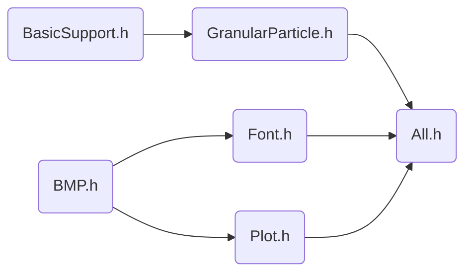

[TOC]

### 使用的公式和单位说明

#### Lennard-Jones

$$
u(r) = 4\epsilon\left(\left(\frac{\sigma}{r}\right)^{12}-\left(\frac{\sigma}{r}\right)^{6}\right)\\
\mathbf{F}(\mathbf{r}) = 24\epsilon\left(2\frac{\sigma^{12}}{r^{13}} - \frac{\sigma^6}{r^7}\right)\hat{\mathbf{r}}
$$

#### Drag Force

$$
f_{ij}=-\gamma(\mathbf{v}_{ij}\cdot\mathbf{r}_{ij})\frac{\mathbf{r}_{ij}}{r_{ij}^2}\\
\gamma = 100
$$

#### unit

| Quantity    | Unit                       | Value of Argon           |
| ----------- | -------------------------- | ------------------------ |
| length      | $\sigma$                   | $3.4\times10^{-10}$ m    |
| energy      | $\epsilon$                 | $1.65\times 10^{-21}$ J  |
| mass        | $m$                        | $6.69\times 10^{-26}$ kg |
| time        | $\sigma(m/\epsilon)^{1/2}$ | $2.17\times 10^{-12}$ s  |
| velocity    | $(\epsilon/m)^{1/2}$       | $1.57\times 10^2$ m/s    |
| force       | $\epsilon/\sigma$          | $4.85\times 10^{-12}$ N  |
| pressure    | $\epsilon / \sigma^2$      | $1.43\times 10^{-2}$ N/m |
| temperature | $\epsilon / k$             | $120$ K                  |

$k = 1.380649\times 10^{-23} J/K$

#### 默认初始

$$
N = 64, L = 20, \Delta t = 0.001, T_0 = 10
$$

### 程序包说明

#### 头文件依赖顺序

#### 类、函数、变量说明

##### ``Pi(BasicSupport.h)`` pi值

$\pi$  。 ``double Pi = 3.14159265358979323846264f`` 。

##### ``sqr(BasicSupport.h)``  平方函数

平方。 ``double sqr(double);`` 。

##### ``DVector(BasicSupport.h)``  向量

|                         定义                         |                           说明                           |
| :--------------------------------------------------: | :------------------------------------------------------: |
|               ``double Elements[3];``                |                **成员变量**，维护向量内容                |
|                 ``void SetZero();``                  | **成员函数**，将向量设为$\overrightarrow 0$ ，不改变维数 |
|               ``double NormSquare();``               |         **成员函数**，返回 $|\mathbf \alpha|^2$          |
|                  ``double Norm();``                  |          **成员函数**，返回 $|\mathbf \alpha|$           |
|                   ``DVector e();``                   |             **成员函数**，返回该方向单位向量             |
|   ``DVector& operator = (const DVector &Other);``    |                    **运算符**，深拷贝                    |
| ``DVector operator + (const DVector &other) const;`` |                     **运算符**，加法                     |
|           ``DVector operator -() const;``            |                     **运算符**，取反                     |
| ``DVector operator - (const DVector &other) const;`` |                     **运算符**，减法                     |
| ``DVector operator * (const double &other) const;``  |                 **运算符**，数乘（右侧）                 |
| ``double operator * (const DVector &other) const;``  |                     **运算符**，内积                     |

##### ``singleParticle(GranularParticle.h)`` 单粒子

|            定义             |             说明             |
| :-------------------------: | :--------------------------: |
|      ``double Mass;``       |      **成员变量**，质量      |
|    ``DVector Position;``    |      **成员变量**，位置      |
|    ``DVector Velocity;``    |      **成员变量**，速度      |
|  ``singleParticle(int);``   | **构造函数**，参数为空间维数 |
|    ``singleParticle();``    |  缺省**构造函数**，默认二维  |
| ``void SetDimention(int);`` |  **成员函数**，设置空间维数  |
|   ``void OutputState();``   |  **成员函数**，输出粒子状态  |

##### ``particleGroup(GranularParticle.h)`` 粒子组

|                             定义                             |                             说明                             |
| :----------------------------------------------------------: | :----------------------------------------------------------: |
|          ``std::vector<singleParticle> Particles;``          |                  **成员变量**，维护粒子状态                  |
|                       ``int Number;``                        |                   **成员变量**，维护粒子数                   |
|                      ``int Dimention;``                      |                  **成员变量**，维护空间维数                  |
|                 ``particleGroup(int, int);``                 |           **构造函数**，参数依次为空间维数、粒子数           |
|                     ``particleGroup();``                     |          缺省**构造函数**，默认二维空间，100个粒子           |
|                       ``void Init();``                       | **成员函数**，设置所有粒子质量为 $1$ ，速度、位置为 $\mathbf 0$ |
|                    ``double KEnergy();``                     |                   **成员函数**，返回总动能                   |
|                  ``double KTemperature();``                  |            **成员函数**，返回温度，定义为平均动能            |
| ``double Energy(double (*Potential)(const singleParticle &, const singleParticle &));`` | **成员函数**，返回体系总机械能，需要传入函数指针``Potential``，定义粒子间两两势能 |
|          ``void PositionRand(double L, double R);``          |   **成员函数**，将所有粒子在空间坐标 $[L,R)$ 之间均匀分布    |
|     ``void PositionRand(double L, double R, double A);``     | **成员函数**，将所有粒子在空间坐标 $[L,R)$ 之间均匀分布，且间距在 $A$ 以上。 |
|             ``void VelocityRand2D(double KT); ``             | **成员函数**，将所有粒子的速度随机分布。满足：速度方向在单位圆上均匀分布，径向速度均匀分布，温度等于``KT``。仅二维体系可用。 |
|             ``void VelocityRand3D(double KT);``              | **成员函数**，将所有粒子的速度随机分布。满足：速度方向在单位球上均匀分布，径向速度均匀分布，温度等于``KT``。仅三维体系可用。 |
| ``void RK4_2(double DeltaT, DVector (*Force)(const singleParticle &a, const singleParticle &b), singleParticle (*BoundaryModifier)(const singleParticle &a));`` | **成员函数**，单步运动模拟，步长为 ``DeltaT`` 。使用适用二阶微分方程的四阶 Ronge-Kutta 方法。需传入函数指针 ``Force`` 定义两个粒子间的力。需传入函数指针 ``BoundaryModifier`` ，定义体系边界和修正方法。 |
| ``void particleGroup::DRK4_2(double &DeltaT, double Cutoff, double MaxDeltaT, double MinDeltaT, DVector (*Force)(const singleParticle &a, const singleParticle &b),singleParticle (*BoundaryModifier)(const singleParticle &a),int ThreadNum);`` | **成员函数**，相较于``RK4_2``，这个函数加入了自适应步长，``Cutoff``表示理想速度插值，``MaxDeltaT``表示最大允许时间步长，``MinDeltaT`` 亦然。调小 ``Cutoff`` 能够提高整体精度，调小 ``MinDeltaT`` 能够提高碰撞部分的精度，调大 ``MaxDeltaT`` 能够一定程度上加速运行时间，但有降低精度的风险。按照问题要求，选择这三个参数为 ``0.001, 0.01, 0.0002`` 是可接受的。 |

##### ``BMP.h`` 暂略

##### ``Font.h`` 暂略

##### ``Plot.h`` 暂略

#### 部分函数技术说明

##### 随机数发生

涉及 ``particleGroup::PositionRand`` ， ``particleGroup::VelocityRand2D`` 和 ``particleGroup::VelocityRand3D`` 。

对于随机数，均采用 ``stl`` 库方法。其中，种子采用机器状态 ``std::random_device`` ，发生器选用梅森旋转 ``std::mt19937`` ，均匀映射采用 ``std::uniform_real_distribution<>`` 和 ``std::uniform_int_distribution<>`` 。

##### 单位球均匀分布

$$
u, v \leftarrow \mathsf{rand}(0.0,1.0)\\
u \leftarrow 2\pi u\\
v \leftarrow \arccos(2v - 1)\\
\hat v_x = \sin(u)\sin(v), \hat v_y = \cos(u)\sin(v), \hat v_z = \cos(v)
$$

### 开发记录（值得记录的Problems&Solutions）

#### 0

使用友元重载运算符（如 ``DVector`` 中的乘法）时，若类的定义在非 ``::`` 下的 namespace 中，在编译的最后一步 ld 时会报 undefined 错误。而这个错误并不会被clang检查到并且能够通过最后一步 ld 之前所有的编译步骤。

放弃使用namespace来区分变量作用域。

（**p.s. by PaimonZAYCHIK**）我并不肯定根本原因是不是这个，但至少，表象是这样的。也有可能是我编译的姿势有问题。遇到这个问题时完全不懂，花了接近四个小时才猜到这个原因。语法检查器没有提示，编译没有 warning，没有 error，函数就在头上还是 undefined。哎。

#### 1

多线程并行运行时，会产生未知运行错误。并不清楚产生的原因，猜测是同时访问 ``std::vector<>::iterator`` 的地址导致。

改用定长数组。

（**p.s. by PaimonZAYCHIK**）stl库的东西在不好用的时候还是很好用的。一旦不好用了你都不知道哪里，什么时候，为什么不好用的。

#### 2

Lennard-Jones势在两个粒子较接近时斜率太大而导致一些问题。比如两个粒子时，两个粒子以较低速度接近。相对较远时受力不明显，两粒子接近。当接近到某一程度时，受力猛增，导致下一帧两个粒子都获得了极大的速度，甚至是相互穿透导致运动模拟完全错误。而实际上这应该被视为弹性碰撞。

这个情况在合理设置初始值时不会出现。

#### 3

在测试算法时发现，即使没有发生碰撞，总能量也会有持续的缓慢变化，按照题给的初始条件，量级在 $1$ 个单位能量每 $100$ 步每$64$粒子。同时增长的概率大于减小。若把时间步长变为原来的 $1/10$ ，那么相同模拟时长下总能量的变化量级变为 $0.1$ 。

这个归为误差，无法解决。

