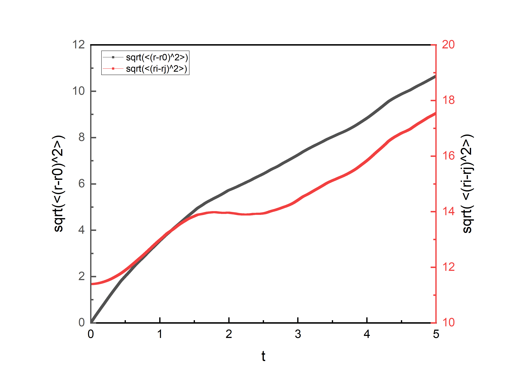
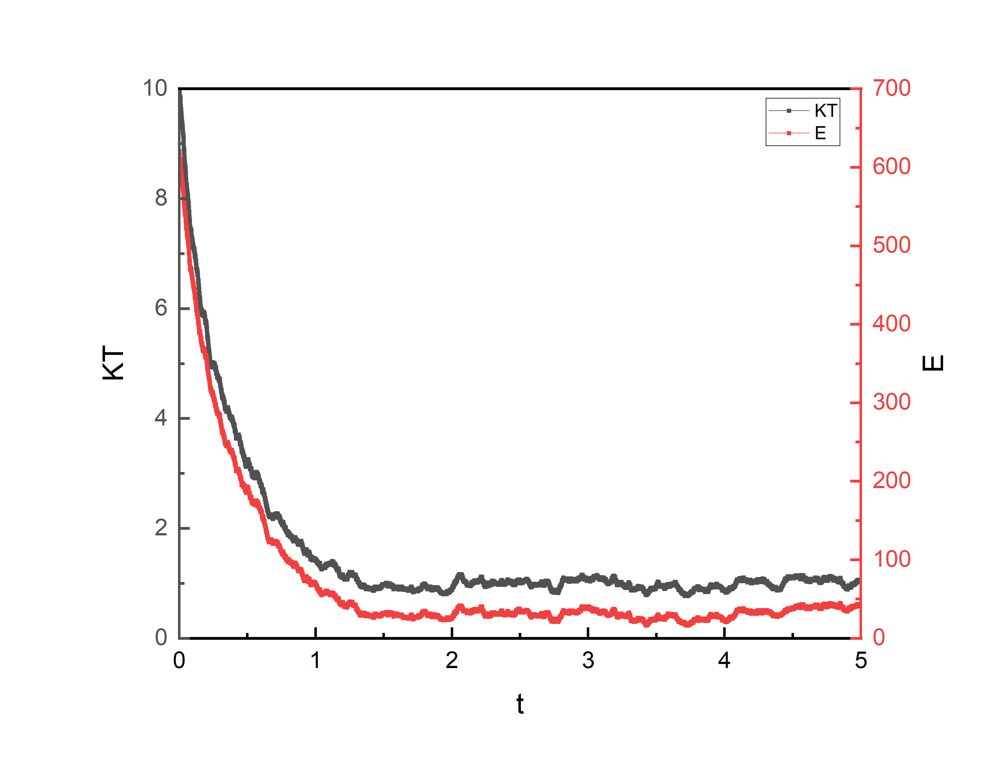

RK4_2，弹性边界，LJ无截断，粘滞力，无random kick

DRK4_2，弹性边界，LJ势无截断，无粘滞力，无random kick

DRK4_2，弹性边界条件，LJ势无截断，有粘滞力，无randomkick

DRK4_2，弹性边界条件，LJ势无截断，有粘滞力，有randomkick，0.1maxKT

DRK4_2，弹性边界条件，LJ势无截断，有粘滞力，有random kick，0.1maxT

DRK4_2，周期边界条件，LJ势无截断，无粘滞力，无random kick

DRK4_2，周期边界条件，LJ势无截断，有粘滞力，有random kick 0.1maxT

